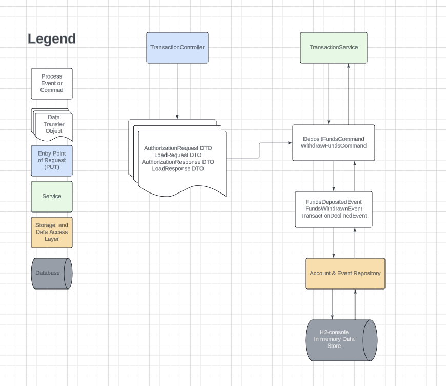

## Bootstrap instructions

To run the server locally, clone the repository onto your local machine.

## Building the application

- Open a terminal in the project directory and run the following command to build the application using Maven:

  `mvn clean install`

## Running the Service:

- Once the build is complete and successful, you can start the application by running:

  `mvn spring-boot:run`

This command will start the Spring Boot application

## Running Tests

- To run the test suite, run:

  `mvn test` or `mvn clean test`

## Accessing the In Memory Database (H2 Database Console)

1. Ensure your application is running.
2. Open a web browser and navigate to the H2 Console URL.

   `http://localhost:8080/h2-console`

3. Use the following default settings to connect (see application.properties configuration):

   `Driver Class: org.h2.Driver`

   `JDBC URL: jdbc:h2:mem:testdb`

   `User Name: sa`

   `Password: (leave this blank)`

4. Click <b>Connect</b> to access the database.

## Verifying Functionality

Ping Endpoint `http://localhost:8080/api/ping` to check server availability

Response:

`Server time: 2024-04-29T15:55:47.068720`

## API

- Load and Authorization Endpoints: Use a REST client like Postman or curl to interact with the` /load` and `/authorization` endpoints

### Load Funds

### Request

`PUT /load`

    Content-Type: application/json

    {
    "userId": "1",
    "messageId": "001",
    "transactionAmount": {
        "amount": "100.00",
        "currency": "USD",
        "debitOrCredit": "CREDIT"
    }
    }

### Response

    {
    "userId": "1",
    "messageId": "001",
    "balance": {placeHolderForUpdatedAccountBalance}
    }

### Authorization Transaction

### Request

`PUT /api/authorization`

    Content-Type: application/json

    {
    "userId": "1",
    "messageId": "002",
    "transactionAmount": {
        "amount": "50.00",
        "currency": "USD",
        "debitOrCredit": "DEBIT"
    }
    }

### Response

`Approved`

    {
        "userId": "1",
        "messageId": "msg001",
        "responseCode": "APPROVED",
        "balance": {placeHolderForUpdatedAccountBalance}
    }

`Declined`

    {
        "userId": "1",
        "messageId": "msg001",
        "responseCode": "DECLINED",
        "balance": {placeHolderForCurrentBalance}
    }

## Events

- In your `http://localhost:8080/h2-console` window
- Go to `EVENT_ENTITY` table and run `SELECT * FROM EVENT_ENTITY` to see events in the order as they are happening

## Architectural Diagram

## Design considerations

While designing the service, its designed to handle financial transactions with a focus on maintaining account balances and transaction integrity. It provides endpoints for loading funds into accounts and authorizing transactions based on available balances. The system leverages Spring Boot for its microservices architecture, making it scalable and easy to maintain.

### Key components:

- <b>Application Structure </b>: I utilized Spring Boot's auto-configuration and dependency injection to setup and wire dependencies for ease of bootstrapping

- <b>Controllers</b>: These handle the HTTP requests and delegate business logic to services, ensuring separation of concerns between the HTTP interface and business logic.

- <b>Services</b>: Contains the core business logic for Transaction processing, including validations, updates and event logging. This can be scaled to handle more in-depth validation checks.

- <b>Repositories</b>: Interface with the h2-console in memory database to perform CRUD operations on the assumed Account entity and record Transaction events to the event store (Event Entity).

- <b>Models</b>: Defined the data structure for accounts and events, encapsulating the state and behavior of data elements.

  - <b>Events</b>: Utilized to ensure all changes to the application state are stored as a sequence of events, allowing the system to reconstruct past states and ensure high integrity and an audit log of operations.

- <b>Data Transfer Objects (DTO)</b>: Serve as data containers for requests and responses, separating external interface of API's from internal data structures.

- <b>Commands</b>: These represent intentions to alter state of the service, which encapsulate information needed to perform actions.

### Design Patterns

The design patterns I incorporated in the project are the Repository, Service Layer, Event Driven and Data Transfer Object patterns.

- Repository Pattern:
  provides a cleaner abstraction for data access and manipulation. (see EventRepository.java)

- Service Layer Pattern:
  defines the application boundary with a set of available operations.

- Event Driven Architecture:
  through the use of required event souring pattern, the system ensures that all state changes are captured as events.

- DTO Pattern:
  prevents over-exposure of internal data structures and provides flexibility for future changes.

### Event Sourcing

The system uses event sourcing to handle the persistence of account states by storing all changes as a sequence of events. This approach provides a audit trail for all transactions but also enhances the system's ability to revert or replay transactions to recover from states in case of failures.

### Transactional Integrity Consideration

Transactions in the system are managed using Spring's `@Transactional` annotation, ensuring that operations are completed successfully before writing results to the database. This transaction management helps prevent data corruption and maintain consistency across operations.

### Scalability Considerations

Used JPA repositories for database interactions, allowing efficient querying and manipulation of data with minimal starter code.

## Assumptions

In developing the bank ledger, I made key assumptions that shaped the architecture and functionality of this bank ledger:

1. Pre-existing User Accounts: I assumed that the system would operate on a set of pre-existing user accounts within the database. This assumption is crucial for validating transaction requests, as it ensures that operations such as loading funds and authorizing transactions are performed on recognized and valid user accounts.

2. Database Seeding: To align with the assumption of pre-existing user accounts, the database is pre-seeded with two user accounts. This setup is intended to facilitate immediate interaction with the API, allowing for demonstration and testing of the `/load` and `/authorization` endpoints without the need for preliminary setup steps by the user.

3. Validation of User Existence: The application's logic includes checks to confirm the existence of a user in the system before processing any transactions. This is based on the assumption that transactions should only be processed for users who are already established within the banks system.

## Deployment considerations

If I were to deploy this and cost wasn't an issue, I would host it on a cloud platform like AWS or Azure using their managed services. I would use either AWS Elastic Beanstalk or Azure App Service for easy deployment and scaling of the web application. For the database, I would use a managed relational database service like Amazon RDS or Azure SQL Database to ensure high availability and performance without the overhead of manual database administration. This setup would allow for automatic scaling, load balancing, and easy management of the application’s lifecycle.

If I were to deploy this for free, I would probably use Google Cloud Platform's free tier which includes Google App Engine which can host this service and Cloud SQL where I can pick to use a PostgresSQL as a data store for the events and account data.
